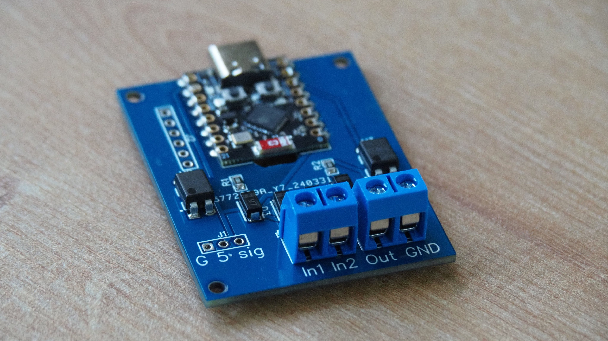
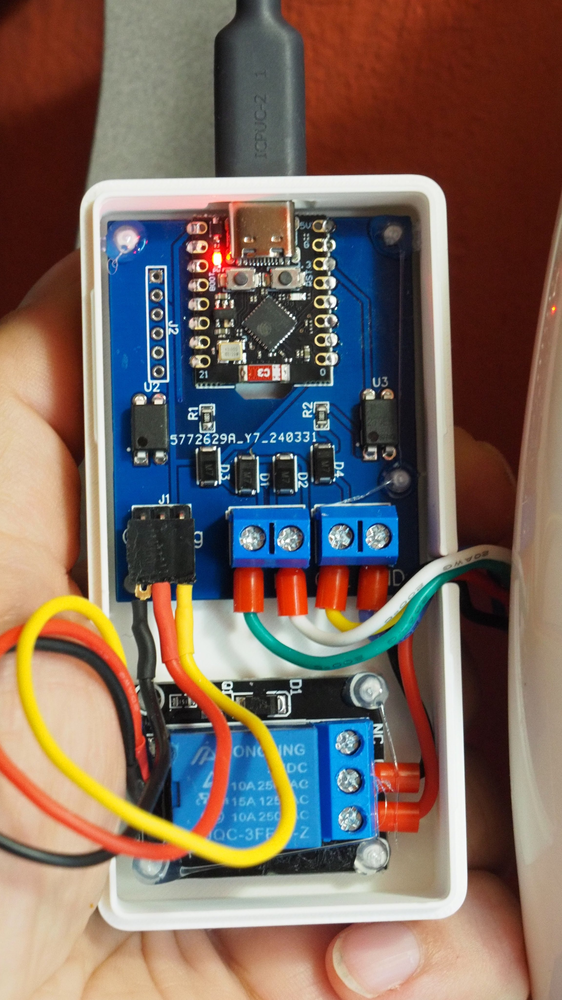

# Smart doorbell

This is a simple-yet-effective upgrade for an ordinary analog doorbell with 12 V control signals like [this one](https://www.czechphone.cz/admin/documents/manual-navod:-dt-verona-16a-bz--mb.pdf). The *original* doorbell is very simple: it can ring (using a mechanical vibrating ringer), it allows two way voice communication and it can open the building door using a solenoid.

This project has following goals (with a minimal changes to the existing system):

 - Pass the ring signal to the Home Assistant for further automations
 - Distinguish between two sources of signal (appartment door vs building door)
 - Activate the solenoid to open the door

The implementation consists of 4 parts:

## HW module




### BOM

* 5V relay module https://pajenicko.cz/rele-modul-jednokanalovy-5v-250vac30vdc-10a?search=PART-E039
  (a separate relay with discrete components would be perfectly OK too, I just used what I had at hand)
* 4x 1N4007 diode
* 2x 2 pin 5 mm screw terminal connectors
* 2x 1K8 resistor
* 1x ESP32C3 super mini https://vi.aliexpress.com/item/1005006170575141.html
* 2x AQY210EH optical isolator

### PCB

* [PDF Schematic](hw/schematic.pdf)
* [Gerber file](hw/gerber.zip)

## ESPHome software

See [this YAML](sw/esphome/doorbell.yaml) for ESPHome. It uses "pulse meter" component to detect any possible ring signal. If the result is around 50 Hz then it's what we are looking for.
It also uses a GPIO switch with a fixed 1.5 second timer to activate the door solenoid on demand.

## HomeAssistant automations 

Because the ESPHome creates a frequency meter component which returns ringing frequency in Hz, I used a simple detector which triggers anywhere between 20 and 70 Hz:

```
trigger:
  - type: value
    platform: device
    device_id: 894a6a762568ffbca8de77be8d6eb37f
    entity_id: 4d5f46038aa4e5b3f17040b8f8039a05
    domain: sensor
    above: 20
    below: 70
```
Nothing more should be needed.
